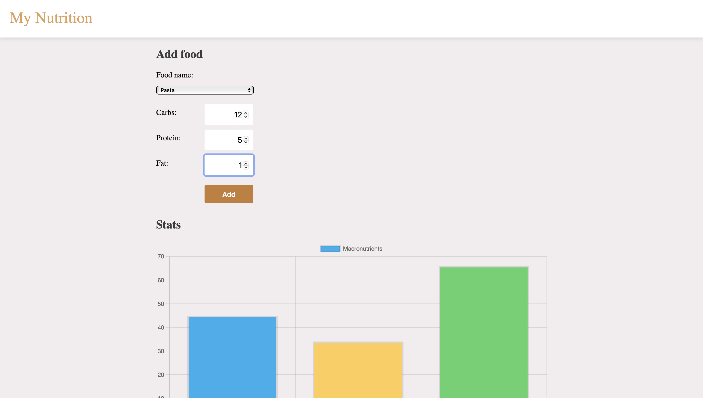
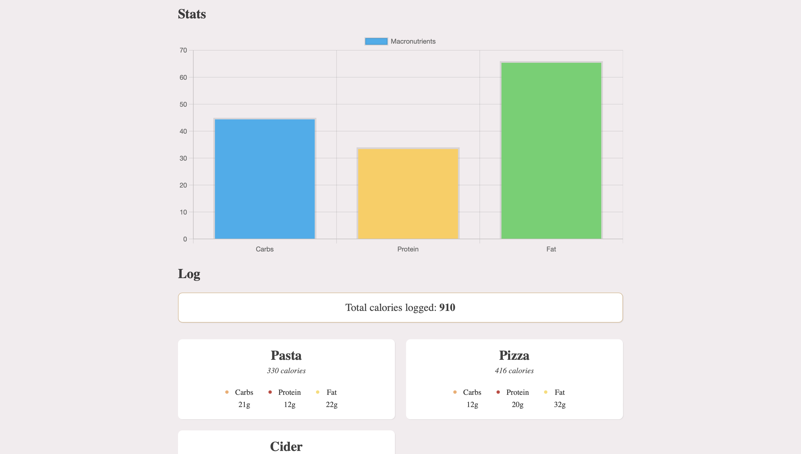
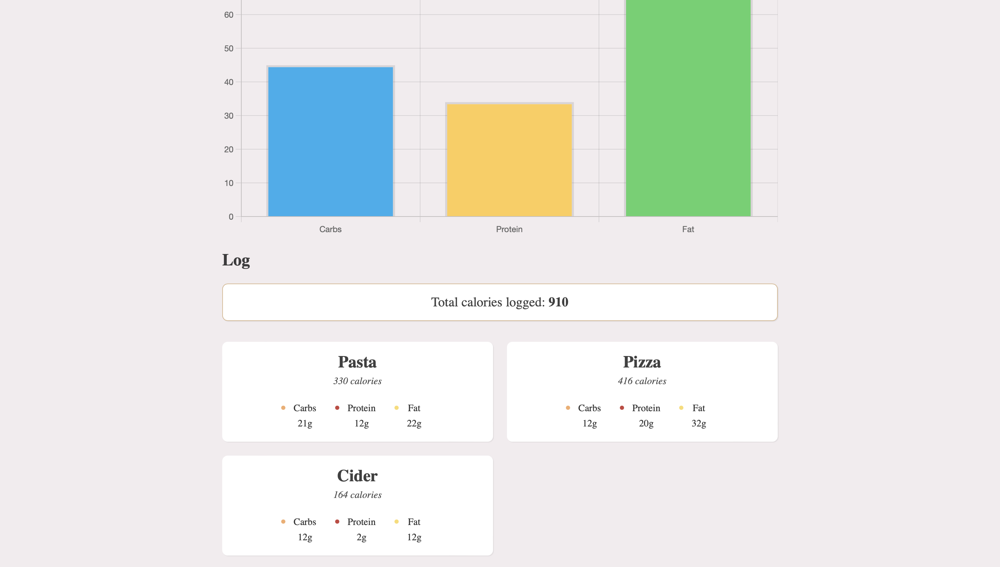
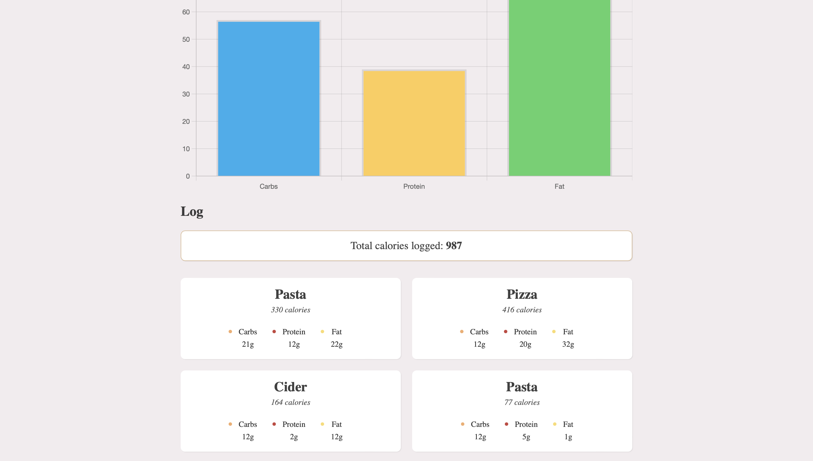

# FoodCalorieTracker 🍴
Food Calorie Tracker and Graph Creator

## Introduction
Welcome to the Food Calorie Counter and Graph Creator! This project aims to provide a simple yet powerful tool for tracking your daily calorie intake and visualizing it in the form of interactive graphs.

## Features
- **Calorie Tracking**: Effortlessly track the calories of the foods you consume throughout the day. Keep a record of your meals and snacks, making it easier to monitor your dietary habits.

- **Food Database**: Access a comprehensive database of various foods. Select and add your macronutrients.

- **Graphical Representation**: Using dynamic graphs, visualize your macronutrient intake over time.

## Getting Started
To get started with the Calorie Counter and Graph Creator, follow the installation and setup instructions outlined in the **Installation Guide**. Once set up, you can begin logging your meals and exploring the graphical representations of your calorie intake.

## Installation Guide
After downloading the project, you will need to run `npm install`. Then, you can run `npm run serve` to serve it and `npm run build` to build it.

Feel free to remix the project. You can use it for your job interview, to start your own project. You can add features, or remove features.

If you'd like to host this project online, you have to change the Base URL of the Firebase API to your own. For that, you need to create a free Firebase account, a new app, and then click on Firestore database.

## Project Snapshots
### Macronutrients section

### Macronutrients graph

### Calories Track

### Calories Track - new entry

## Conclusion
Feel free to fork this project, experiment, and make it your own. Your creativity and expertise can elevate this calorie tracker website to new levels. I encourage you to share your modifications and enhancements with the community, contributing to an even better tracking experience.

Thank you for your interest in this project, and I eagerly await your contributions. Together, let's build a comprehensive and user-friendly calorie tracking solution that empowers individuals to achieve their health and wellness goals.

Happy coding and happy tracking!

